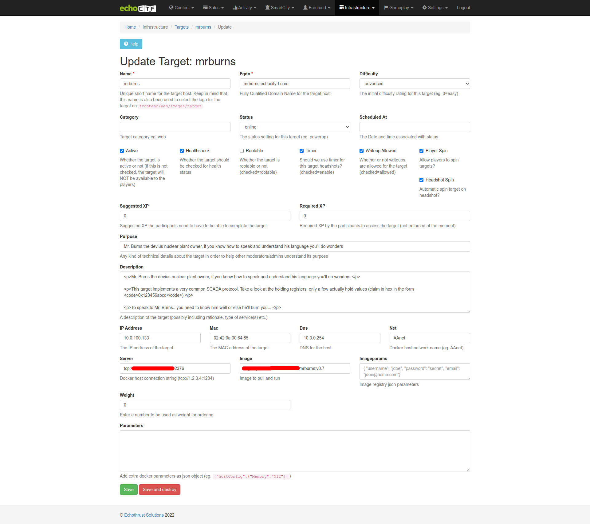
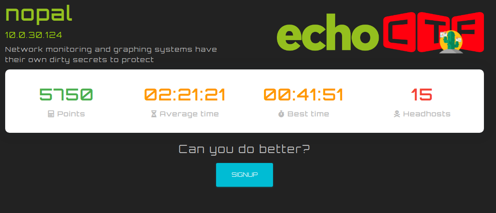
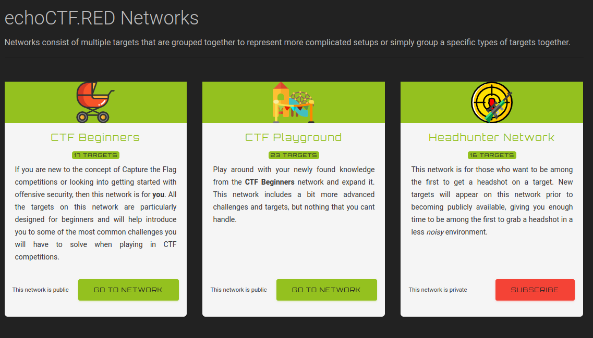

[](http://echoctfred.readthedocs.org/)


echoCTF is a pioneer computer security framework, developed by
Echothrust Solutions, for running CyberSecurity exercises and competitions such
as Capture the Flag.

echoCTF allows building and running capture the flag competitions for network
penetration testing and security auditing on real IT infrastructure. It is
also used for security awareness and training purposes, by businesses and
educational institutes.

# What is echoCTF.RED
echoCTF.RED <sub>(codename Mycenae),</sub> is the first iteration of our online
long running CTF service, based on the applications from this repository.

It is a free online service that offers a controlled environment, based on
real-life systems and services, to train and sharpen your offensive and
defensive security skills. Scan, brute-force and do whatever it takes to
attack the systems and solve the real-life security scenarios to gain points.

For more information about our competitions visit [https://echoCTF.com/](https://echoCTF.com/) or if
you'd rather see a live example of our platform feel free to visit [https://echoCTF.RED/](https://echoCTF.RED/)

Our main goals for echoCTF include:
* **Completeness** - Provide a complete set of tools and applications to develop, deploy and maintain competitions
* **Modularity** - Each component has a unique and clear role
* **Expandability** - echoCTF's components are designed to permit expansion

## Quick start
```sh
$ git clone https://github.com/echoCTF/echoCTF.RED.git
$ cd echoCTF.RED
$ docker pull echothrust/echoctf.red-db:latest
$ docker pull echothrust/echoctf.red-backend:latest
$ docker pull echothrust/echoctf.red-frontend:latest
$ docker pull echothrust/echoctf.red-vpn:latest
$ docker-compose up
```
_NOTE_: The following ports will be binded localy `1194/udp`, `8080/tcp`, `8082/tcp`, `3306/tcp`, `11211/tcp`. If any of these ports are already in use the applications will fail to start.

Please note that the docker images are intended for development and testing use only. For production environments we suggest to use the provided playbooks (under `ansible/runonce`) to setup the systems.

For more details check the [echoCTF.RED@ReadTheDocs](https://echoctfred.rtfd.io) :notebook_with_decorative_cover:

## Screenshots :eyes::candy:
<table>
  <tr>
    <td>
      <center>

Admin page target update
</center>
    </td>
    <td><center>
       Guest player target view</center>
    </td>
    <td><center>
      
       Admin page target solving stats</center>
    </td>
  </tr>
  <tr>
  <td colspan="2"></td>
  <td></td>
  </tr>
</table>

## Features
The list of features supported by the platform is really massive, the most
interesting are as following:

* System settings
  - Configurable Event name
  - Configurable Active status
  - Configurable timezone
  - Configurable event start / end dates
  - Configurable registration opening / closing dates
* Leaderboard settings
  - Independent Player and Team leaderboards
  - Configurable visibility before and after event start/end
  - Support to show/hide 0 point players
* Team settings
  - Configurable teams support
  - Configurable mandatory teams flag
  - Configurable team management
  - Configurable number of maximum team members
* Player and Registration settings
  - Configurable activation required
  - Support for global enable/disable registrations
  - Configurable player profiles
  - Configurable player avatar approval
  - Configurable player profile visibility
  - Configurable default player homepage
  - Configurable settings and memory key expiration timeout
  - Configurable global and individual player number of restarts
* Twitter settings
  - Configurable tagging accounts (via)
  - Configurable automatic hashtags
  - Quick share links on every event on frontend
* Support for configurable Targets and Challenges
  - Target support for start/stop/logs/exec/healthchecks
  - Unlimited flags per targets & challenges
  - Dynamic target networks
  - Dynamic target environment variables
  - Dynamic target volumes
  - Support for public and private networks
  - Support for ondemand start of targets
  - Target documentation and metadata
  - Multiple question/flag challenges
  - Dynamic hints
  - Configurable tracking of solving times for challenges and targets
  - Support for target and challenge logos
  - Support for player rating of targets & challenges
  - Support for player contributed writeups
* Detailed activity streams
  - Player overall activity
  - Player vs Target activity
  - All platform activity
  - Team based activity
* Network activity tracking and visuals
* REST support
* Docker API support
* Help/Rules/FAQ/Instructions sections
* URLs Management add/edit/delete/disable
* Separate player and admin interfaces and authentication databases
* Configurable SSL certificate details
* Twitter & Linkedin support for publishing achievements
* Stand-alone applications for activity streaming
  - Bots for discord and twitter announcements
  - websocket leaderboards
  - websocket activity stream visuals
  - real time network visuals through logstalgia and gource
  - dynamic post claim flag actions
* Advanced player and general moderation features
  - Ban MX servers from registering
  - Disable per player URLs
  - Ban player username/email patterns
* Integrated OpenBSD (PF) firewall features
* Support for online subscriptions (Stripe integration)
* Detailed auditing of flags and network activity

**NOTE:** Dynamic firewall support and network tracking of players is not support on the `docker-compose` versions.

## Disclaimer
The documents and guides in this repository are only examples and are not meant
to be used to setup production environments.

Special care should be taken with securing and restring access to your setups.

Apply common logic when copy pasting commands and files :)

echoCTF is software that comes with absolutely no warranties whatsoever. By
using echoCTF, you take full responsibility for any and all outcomes that
result.

Keep in mind that the system comes up with absolutely no data. This means
that it is up to you to create targets, challenges, rules, instructions and
any other details you require.
