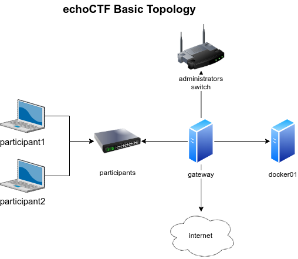

# Onsite infrastructure guide
The following guide is based on the setup we perform for CTF events that for
some reason or the other cannot work through a cloud infrastructure or simply
require snappy access to the targets.

In such cases we opt to provide our own pre-configured servers to host and run
the CTF on any location that has electricity.

This allows participants to compete at whatever speeds their LAN can provide.

The setups we deploy in such events vary on the number of participants and the
specific requirements and limitations imposed.

## Basic Setup
The general topology we follow for our setups starts with an OpenBSD
gateway/vpn server and a Debian docker server, as illustrated below.

This basic setup assumes 50 local participants with 10 to 20 targets.

The hardware specifications for the servers vary but for a small event the
following should be more than enough:
* RAM: 32GB
* CPU: Intel(R) Xeon(R) CPU E5345 @ 2.33GHz
* Storage: 160GB SSD

**Gateway**:
The gateway runs all applications needed, except for the docker containers. It
has a Quad Gigabit ethernet adapter with 3 ethernet interfaces being used by
the setup and the fourth one if we also need to provide internet access to the
participants through our gateway.

Each of the applications run on their own interface, user id, chroot, packet
filtering rules and service control.

Players connect to the `participants` switch and access the frontend and openvpn.

Event managers connect to the `administrators` switch and can access the
backend and SSH to the gateway. Unrestricted access is provided to system
administrators to be able to access the backend infrastructure as well as any
other available resource.

__NOTE__: Only our support engineers are allowed to connect to the
`administrators` switch for the events we develop and deliver.

**Docker01**:
The docker01 system connects with a crossover cable to the gateway.

## Increased requirements
As the needs increase we adapt the above setup based on the specifics of the
requirements.

The easiest route is to gradually increasing the hardware specifications for
the gateway and docker server. With this approach we have been able to provide
infrastructure for an event of 300 participants with 100 targets.

The hardware specifications for the servers in that case were as following
* Gateway OpenBSD
  - RAM: 32GB,
  - CPU: Intel Core i7 9700K @ 3.60GHz
  - Storage: 160GB SSD
* Docker Debian
  - RAM: 196GB
  - CPU: Intel(R) Xeon(R) CPU E5-2630 v4 @ 2.20GHz
  - Storage: 500GB SSD

When the option to increase the hardware specs is no longer viable, we switch
into splitting services into multiple servers starting with the addition of
new docker servers.

