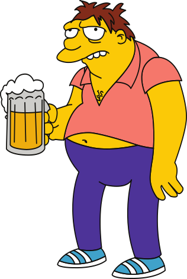

# Personalizing your installation

## Changing Defaults
The following section will explain what files you need to modify in order to change default values of the setup.

### How do i change the subnet for the VPN clients?
If you want to change the OpenVPN clients ranges you will have to update the following files and rebuild the images and the volume `openvpn-data`

Edit *`contrib/openvpn_tun0.conf`* and adapt Line 40 to your needs
```
server 10.10.0.0 255.255.0.0
```

### How do i change the subnet for the targets
If you want to modify the ranges of the targets edit `contrib/openvpn_tun0.conf` and modify the lines 41-43
```
push "route 10.0.100.0 255.255.255.0"
push "route 10.0.160.0 255.255.255.0"
push "route 10.0.200.0 255.255.255.0"
```

Update the docker-compose.yml with the respective ranges and rebuild

### How to move the VPN to another VM or host?
Follow the instructions from [DOCKER-COMPOSE-NOVPN.md](DOCKER-COMPOSE-NOVPN.md)


## Images and Logos
### Frontend Logos
* Sidepanel small logo `@webroot/images/logo-red-small.png`
* frontend logo `@webroot/images/logo.png`
* background on target view overlay `@webroot/images/targetbg.png`

### Targets
* Twitter image `@webroot/images/targets/targetname.png`
* Target Listing image `@webroot/images/targets/_targetname-thumbnail.png`
* Target view image `@webroot/images/targets/_targetname.png`

#### Adding a new target image
For each target three files are to be created.
* `_targetname.png` 220x300px
* `_targetname-thumbnail.png` 110x150px
* `targetname.png`
The first is used by the target listing and target view/vs on the left side. This is a plain "character" logo for the target prefixed with an underscore (`_`) such as



The second includes and one that has a background of the main black logo and the target overlay-ed such as


Once these images are in place you have to run the following command to generate the thumbnails: `gulp createMiniIMG`


In order to minify and optimize the generated images you need to run the following: `gulp minifyIMG`

Both commands need to run under `echoCTF.RED/themes/material-dashboard`.

Finally ensure you have copied the images over at `echoCTF.RED/frontend/web/images/targets/` like so

```sh
cp echoCTF.RED/themes/images/targets/*.png  echoCTF.RED/frontend/web/images/targets/
```


## Theme
The sources for the themes and images being used can be found under `themes/`

* `fontawesome/` Font Awesome theme
* `images/avatars/` (sample avatars)
* `images/flags/` (flag icons)
* `images/targets/` (existing target images)
* `material-dashboard/` theme html/CSS/js sources
