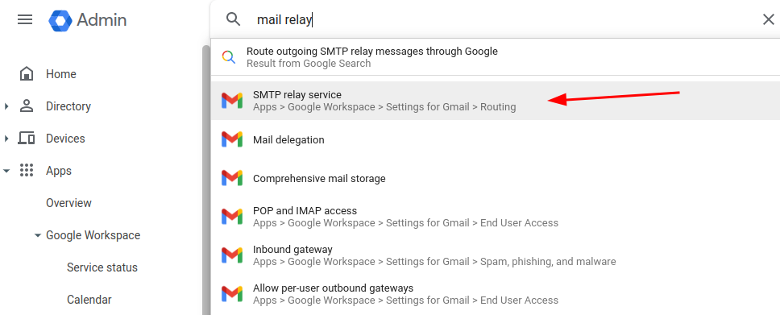
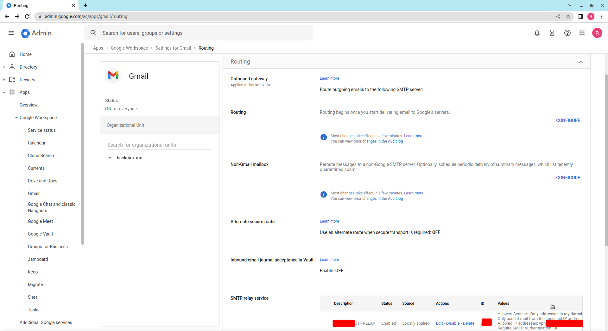
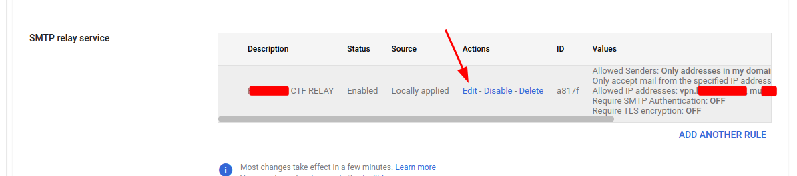
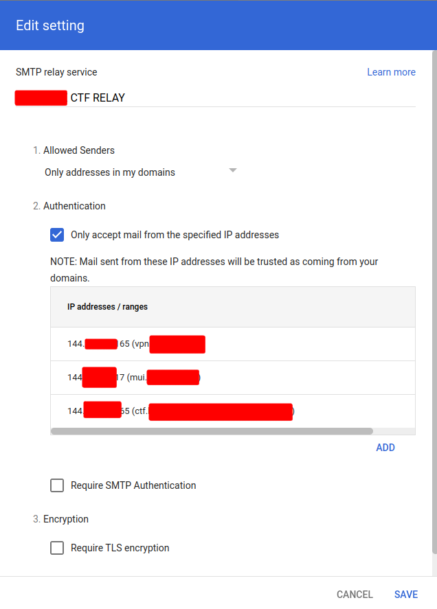

# Google Workspaces non-auth SMTP Setup
The following document outlines the steps required to configure your Google Workspaces with non authenticated SMTP relay.

The process involves adding the IP addresses of the systems that will be allowed to relay emails through google.

1. Login to your domain control panel (usually at admin.google.com)
2. Search for the "SMTP relay service"
   
3. Scroll down to the "SMTP relay service" and create one group for your servers
   
4. Edit or Add new entries
   
5. Add one entry for each of your hosts
   

Save the changes and allow 10-20 minutes for the changes to propagate before giving it a try.